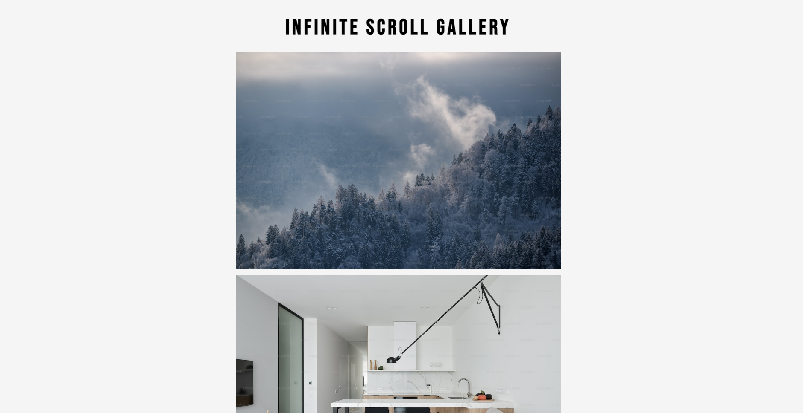

# Infinity Scroll Gallery

O site desenvolvido com Javascript permite que imagens provenientes de uma API sejam carregadas infinitamente, possibilitando que o usuário navegue por uma grande quantidade de imagens sem interrupções. Além disso, o carregamento das imagens é rápido e suave, proporcionando uma experiência de navegação agradável e sem a necessidade de clicar em botões para carregá-las.
## 🚀 Demonstração

[Clique aqui](link-aqui) para acessar o resultado final do projeto.

## 🛠️ Tecnologias Utilizadas

* [HTML](https://developer.mozilla.org/pt-BR/docs/Web/HTML) - Linguagem de Marcação
* [CSS](https://developer.mozilla.org/pt-BR/docs/Web/CSS) - Linguagem de Estilização
* [Javascript](https://developer.mozilla.org/pt-BR/docs/Web/JavaScript) - Linguagem de Programação

## 👨‍💻 Desenvolvedor

    
    
&nbsp&nbsp&nbspFlávio Mattos 
    &nbsp&nbsp&nbsp<a href="https://www.instagram.com/fflaviomattos/">Instagram</a>&nbsp;|&nbsp;<a href="https://github.com/FlavioMattosDev">GitHub</a>&nbsp;|&nbsp;<a href="https://www.linkedin.com/in/flavio-mattos/">LinkedIn</a>&nbsp;

  

---
